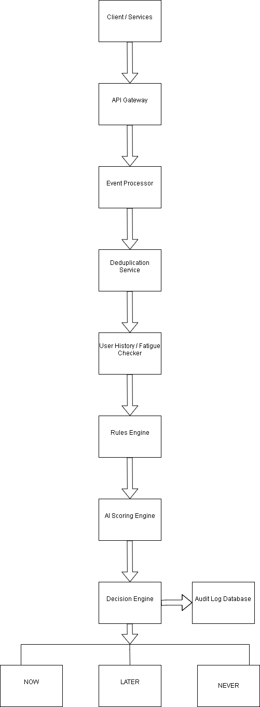

# High-Level Architecture

# System Architecture

## Components

1. API Gateway
   - Receives notification events

2. Event Processor
   - Validates and normalizes input

3. Deduplication Service
   - Checks exact and near duplicates

4. Rules Engine
   - Applies configurable business rules

5. AI Scoring Engine
   - Calculates urgency & noise score

6. Decision Engine
   - Final classification (Now / Later / Never)

7. Scheduler
   - Stores deferred notifications

8. Audit Logger
   - Logs reason for each decision

9. Database
   - Stores events, history, logs

## Data Flow

1. Event received via API
2. Duplicate check performed
3. User notification history checked
4. Rules applied
5. AI scoring (if available)
6. Decision finalized
7. Decision logged
8. Notification sent or scheduled